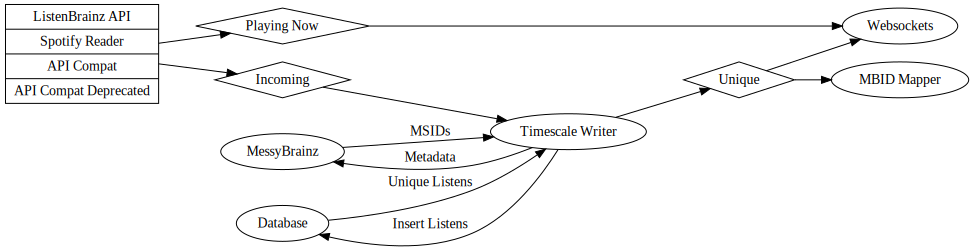

============
Architecture
============

Services
========

This is a list of the docker containers for ListenBrainz services used in local development and running in the
MetaBrainz server infrastructure.

.. list-table:: Webservers
   :widths: 15 20 65
   :header-rows: 1

   * - Development
     - Production
     - Description

   * - web
     - listenbrainz-web-prod
     - serves the ListenBrainz flask app for the website and APIs (except compat APIs).

   * - api_compat
     - listenbrainz-api-compat-prod
     - serves a flask app for only Last.fm compatible APIs.

   * - websockets
     - listenbrainz-websockets-prod
     - runs websockets server to handle realtime listen and playlist updates.

.. list-table:: Databases and Cache
   :widths: 15 20 65
   :header-rows: 1

   * - Development
     - Production
     - Description

   * - redis
     - listenbrainz-redis
     - redis instance used for caching all stuff ListenBrainz.

   * - lb_db
     - listenbrainz-timescale
     - timescale instance for ListenBrainz to store listens and playlists. in development environment, the all databases
       are part of `lb_db` container.

   * - lb_db
     - postgres-floyd
     - primary database instance shared by multiple MetaBrainz projects. The main ListenBrainz DB resides here as well
       as the MessyBrainz DB.

.. list-table:: Misc Services
   :widths: 15 20 65
   :header-rows: 1

   * - Development
     - Production
     - Description

   * - timescale_writer
     - listenbrainz-timescale-writer-prod
     - runs timescale writer which consumes listens from incoming rabbitmq queue, performs a messybrainz lookup and
       inserts listens in the database.

   * - spotify_reader
     - listenbrainz-spotify-reader-prod
     - runs a service for importing listens from spotify API and submitting to rabbitmq.

   * - spark_reader
     - listenbrainz-spark-reader-prod
     - processes incoming results from spark cluster like inserting statistics in database etc.

   * - rabbitmq
     - rabbitmq-clash
     - rabbitmq instance shared by MetaBrainz services. listenbrainz queues are under /listenbrainz vhost.

.. list-table:: Only Production Services
   :widths: 30 70
   :header-rows: 1

   * - Production
     - Description

   * - listenbrainz-labs-api-prod
     - serves a flask app for experimental ListenBrainz APIs

   * - listenbrainz-api-compat-nginx-prod
     - runs a nginx container for the compat API that exposes this service on a local IP, not through gateways.

   * - listenbrainz-cron-prod
     - runs cron jobs used to execute periodic tasks like creating dumps, invoking spark jobs to import dump, requesting
       statistics and so on.

   * - exim-relay-listenbrainz.org
     - smtp relay used by LB to send emails.

   * - listenbrainz-typesense
     - typesense (typo robust search) used by the mbid-mapping.

   * - listenbrainz-mbid-mapping
     - A cron container that fires off periodic MBID data processing tasks.

   * - listenbrainz-mbid-mapping-writer-prod
     - Maps incoming listens to the MBID mapping as well as updating the mapping.

   * - listenbrainz spark cluster
     - spark cluster to generate statistics and recommendations for LB.

Listen Flow
===========

Listens can be submitted to ListenBrainz using native ListenBrainz API, Last.fm compatible API (API compat) and
AudioScrobbler 1.2 compatible API (API compat deprecated). Each api endpoint validates the listens submitted through it
and sends the listens to a RabbitMQ queue based on listen type. Playing Now listens are sent to the Playing Now queue,
and permanent listens are sent to the Incoming queue.

Playing now listens are ephemeral are only stored in Redis, with an expiry time of the duration of the track. The
Playing now queue is consumed by Websockets service. The frontend connects with the Websockets service to display
listens on the website without manually reloading the page.

On the other hand, "Permanent" Listens need to be persisted in the database. Timescale Writer service consumes from the
Incoming queue. It begins with querying the MessyBrainz database for MessyBrainz IDs. MessyBrainz tries to
find an existing match for the hash of the listen in the database. If one exists, it is returned otherwise it inserts
the hash and data into the database and returns a new MessyBrainz ID.

Once the writer receives MSIDs from MessyBrainz, the MSID is added to the track metadata and the listen is inserted in the
listen table. The insert deduplicates listens based on a (user, timestamp, track_name) triplet i.e. at a given timestamp,
a user can have a track entry only once. As you can see, listens of different tracks at the same timestamp are allowed
for a user. The database returns the "unique" listens to the writer which publishes those to Unique queue.

Websockets consume from the unique queue for the same purpose as with now playing listens. The MBID mapper also consumes
from the unique queue and builds a MSID->MBID mapping using these listens.

Frontend Rendering
==================

ListenBrainz frontend pages are a blend of Jinja2 templates (Python) and React components (Javascript). The Jinja2
templates used are bare bones , they include a placeholder div called `react-container` into which the react components
are rendered. To render the components, some data like current user info, api url etc are needed. These are injected as
json into two script tags in the HTML page, to be consumed by the React application: page-react-props and
global-react-props.

Most ListenBrainz pages will have a Jinja2 template and at least 1 React component file. The components are written in
Typescript, and we use Webpack to transpile them to javascript, to compile CSS from LESS and to minify and bundle
everything. In local development, this is all done in a separate Docker container `static_builder` which watches for
changes in front-end files and recompiles automatically. In production, the compilation happens only once and at time
of building the docker image.

Using script tags, we manually specify the appropriate compiled javascript file to include on a given page in its
Jinja2 template.
