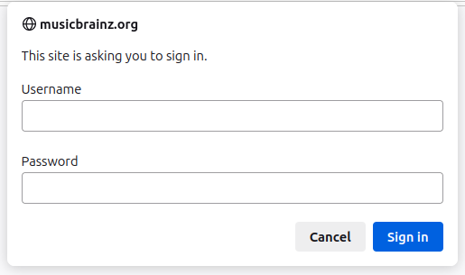

Server development
==================

Set up ListenBrainz Server development environment
--------------------------------------------------

To contribute to the ListenBrainz project, you need a development environment.
With your development environment, you can test your changes before submitting a
patch to the project. This guide helps you set up a development environment
and run ListenBrainz locally on your workstation. By the end of this guide, you
will have…

* Installed system dependencies
* Registered a MusicBrainz application
* Initialized development databases
* Running ListenBrainz Server

Clone listenbrainz-server
-------------------------

ListenBrainz is hosted on GitHub at https://github.com/metabrainz/listenbrainz-server/.
You can use ``git`` to clone it (or your own fork) to your computer

.. code-block:: bash

    git clone https://github.com/metabrainz/listenbrainz-server.git

Install docker
--------------

ListenBrainz uses Docker for development. This helps you to easily create your development
environment. Therefore, to work on the project, you first need to install Docker.
If you haven't already, follow the `docker installation instructions for your platform`_.

.. _docker installation instructions for your platform: https://docs.docker.com/get-docker/

Register a MusicBrainz application
----------------------------------

Next, you need to register your application and get an OAuth token from
MusicBrainz. This allows you to sign into your development
environment with your MusicBrainz account.

To register, visit the `MusicBrainz applications page`_. There, look for the
option to `register`_ your application. Fill out the form with the following data:

- **Name**: (any name that you want and will recognize, e.g.
  ``listenbrainz-server-devel``)

- **Type**: ``Web Application``

- **Callback URL**: ``http://localhost:8100/login/musicbrainz/post/``

After entering this information, you'll have an OAuth client ID and OAuth client
secret. You'll use these for configuring ListenBrainz.

.. _MusicBrainz applications page: https://musicbrainz.org/account/applications
.. _register: https://musicbrainz.org/account/applications/register

Update config.py
^^^^^^^^^^^^^^^^

With your new client ID and secret, update the ListenBrainz configuration file.
If this is your first time configuring ListenBrainz, copy the sample to a live
configuration.

.. code-block:: bash

    cp listenbrainz/config.py.sample listenbrainz/config.py

Now, open the new config.py file (don’t change config.py.sample) with your favorite
text editor and look for this section.

.. code-block:: yaml

    # MusicBrainz OAuth
    MUSICBRAINZ_CLIENT_ID = "CLIENT_ID"
    MUSICBRAINZ_CLIENT_SECRET = "CLIENT_SECRET"

Update the strings with your client ID and secret. After doing this, your
ListenBrainz development environment is able to authenticate and log in from
your MusicBrainz login.

.. note:: 
    Make sure the ``MUSICBRAINZ_CLIENT_ID`` and ``MUSICBRAINZ_CLIENT_SECRET`` parameters are set properly, 
    failing to do so will result in a basic browser auth popup like the one below:

To use the Last.fm importer you need an API account at Last.fm. You can
register for one at the `Last.fm API page`_. Look for the following section in ``config.py``.

.. code-block:: yaml

    # Lastfm API
    LASTFM_API_URL = "https://ws.audioscrobbler.com/2.0/"
    LASTFM_API_KEY = "USE_LASTFM_API_KEY"

Update the ``LASTFM_API_KEY`` field with your Last.fm API key.

You also need to update the ``API_URL`` field value to ``http://localhost:8100``.

To use the Spotify importer you need to register an application on the
`Spotify Developer Dashboard`_. Use ``http://localhost:8100/settings/music-services/spotify/callback/``
as the callback URL.

After that, fill out the Spotify client ID and client secret in the following
section of the file.

.. code-block:: yaml

    # SPOTIFY
    SPOTIFY_CLIENT_ID = ''
    SPOTIFY_CLIENT_SECRET = ''

.. note::

    The hostname on the callback URL must be the same as the host you use to
    access your development server. If you use something other than ``localhost``, you
    should update the ``SPOTIFY_CALLBACK_URL`` field accordingly.

.. _Last.FM API page: https://last.fm/api
.. _Spotify Developer Dashboard: https://developer.spotify.com/dashboard/applications

To use the CritiqueBrainz reviewer, you'll need to visit the `CritiqueBrainz applications page`_
and create/register an application. Use ``http://localhost:8100/`` as the homepage URL and ``http://localhost:8100/settings/music-services/critiquebrainz/callback/``
as the callback URL.

After registering, update the CritiqueBrainz section of the file with the client ID and client secret
you obtained.

.. code-block:: yaml

    # CRITIQUEBRAINZ
    CRITIQUEBRAINZ_CLIENT_ID = ''
    CRITIQUEBRAINZ_CLIENT_SECRET = ''
    CRITIQUEBRAINZ_REDIRECT_URI = 'http://localhost:8100/settings/music-services/critiquebrainz/callback/'

.. note::

    Again, if you use something other than ``localhost`` as the host you use to access your development server,
    you should update the ``homepage`` and ``Authorization callback URL`` fields accordingly when registering on CritiqueBrainz.

.. _CritiqueBrainz applications page: https://critiquebrainz.org/profile/applications/

Initialize ListenBrainz containers
----------------------------------

Next, run

.. code-block:: bash

    ./develop.sh build

in the root of the repository. Using ``docker-compose``, this will build multiple
Docker images for the different services that make up the ListenBrainz server.

The first time you run this script it might take some time while it downloads all of the
required dependencies and builds the services.

Initialize ListenBrainz databases
---------------------------------

Your development environment needs some specific databases to work. Before
proceeding, run these commands to initialize the databases.

.. code-block:: bash

    ./develop.sh manage init_db --create-db
    ./develop.sh manage init_ts_db --create-db

Your development environment is now ready. Now, let's actually see ListenBrainz
load locally!

Run the magic script
--------------------

Now that the databases are initialized, you can start your development
environment by running ``develop.sh up``.

.. code-block:: bash

    ./develop.sh up

.. note::

    By default, the web service listens on port 8100. If you already have a service listening
    on this port, then you can change it by updating the ports section of ``docker/docker-compose.yml``.

    .. code-block:: bash

        ports:
        - "8100:80"

    To change the listening port, change only the value before the ":" to the port of your choice
    and point your browser to ``http://localhost:<Port>``

You will see the output of ``docker-compose``. You can shut down listenbrainz
by pressing CTRL^C. Once everything is running, visit your new site in a browser!

.. code-block:: none

   http://localhost:8100

Now, you are all set to begin making changes and seeing them in real-time inside
of your development environment. If you make changes to python code, the server will be
automatically restarted. If you make changes to javascript code it will be
automatically compiled.

Look at the :doc:`develop.sh documentation <develop-sh>` for more details.

Listenbrainz containers
-----------------------

A listenbrainz development environment contains a number of different containers running
different services. We provide a small description of each container here:

* ``db``: A PostgreSQL server that contains data about users
* ``redis``: A redis server to store temporary server data
* ``timescale``: A PostgreSQL server with the TimescaleDB extension that stores users listens
* ``rabbitmq``: Used for passing listens between different services
* ``web``: This is the main ListenBrainz server
* ``api_compat``: A Last.fm-compatible API server
* ``websockets``: A websocket server used for the user-following and playlist updates on the front-end
* ``static_builder``: A helper service to build Javascript/Typescript and CSS assets if they are changed

.. note::

    If you add new python dependencies to ListenBrainz by adding them to ``requirements.txt`` you will have
    rebuild the web server. Use

    .. code-block:: bash

        ./develop.sh build web

    to do this.

    If you add new Javascript dependencies you will have to rebuild the ``static_builder``:

    .. code-block:: bash

        ./develop.sh build static_builder

Test your changes with unit tests
---------------------------------

Unit tests are an important part of ListenBrainz. It helps make it easier for
developers to test changes and help prevent easily avoidable mistakes later on.
Before committing new code or making a pull request, run the unit tests on your
code.

.. code-block:: bash

   ./test.sh

This builds and runs the containers needed for the tests. This script configures
test-specific data volumes so that test data is isolated from your development
data. Note that all tests are run: Unit tests and integration tests.

To run tests faster, you can use some options to start up the test infrastructure
once so that subsequent running of the tests is faster:

.. code-block:: bash

   ./test.sh -u # build unit test containers, start up and initialise the database
   ./test.sh    # run tests, do this as often as you need to
   ./test.sh -s # stop test containers, but don't remove them
   ./test.sh -d # stop and remove all test containers

If you made any changes to the frontend, you can run the tests for frontend using

.. code-block:: bash

   ./test.sh fe

You can also make use of the following frontend testing options for efficient testing.

.. code-block:: bash

   ./test.sh fe             run frontend tests
   ./test.sh fe -u          run frontend tests, update snapshots
   ./test.sh fe -b          build frontend test containers
   ./test.sh fe -t          run type-checker

When the tests complete, you will see if your changes are valid or not. These tests
are a helpful way to validate new changes without a lot of work.

Lint your code
--------------

ListenBrainz uses ESLint to lint the frontend codebase as part of the development process, in Webpack.

ESLint will automatically fix trivial issues and list all other issues in your terminal.
Make sure to fix any error with the code you've modified.

There can be quite a lot of logs in the terminal, so if you want to look only at front-end build output, you can use this command to inspect only the static_builder logs:

.. code-block:: bash

   ./develop.sh logs -f static_builder

.. include:: develop-sh.rst
