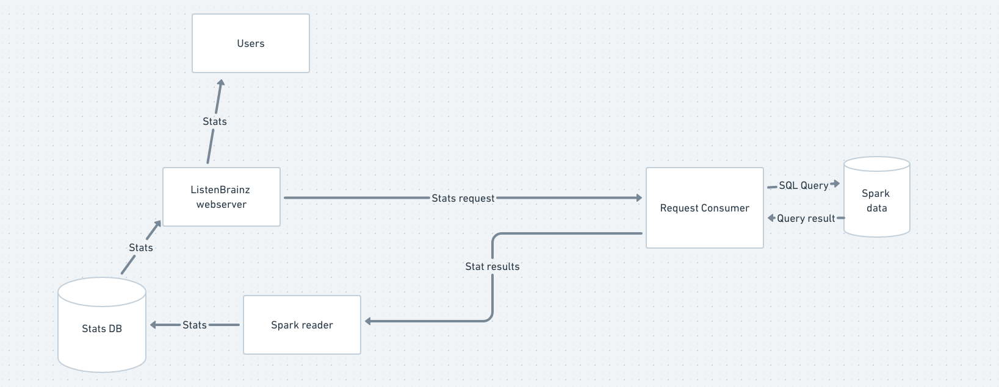

Spark Architecture
==================

In order to actually build features that use Spark, it is important to
understand how the ListenBrainz webserver and the Spark environment
interact.

The ListenBrainz webserver and Spark cluster are completely seperate entities,
only connected by RabbitMQ. This document explains how they interact with each
other, taking the example of a stat.

The ListenBrainz environment sends a request to the `request_consumer` script
via RabbitMQ. The request consumer, which is connected to Spark, takes the
request and uses Spark to compute an appropriate response (or many responses).
The request consumer then sends these responses via RabbitMQ to the `spark_reader`
script, which runs alongside the webserver. The spark reader then takes the responses,
and in the case of a stat, writes them to the ListenBrainz PostgreSQL database.
Now that the stat has been updated in the database, users can view them on
listenbrainz.org or via the API.

Developing request_consumer
---------------------------

Start the webserver
^^^^^^^^^^^^^^^^^^^

.. code-block:: bash

    ./develop.sh up

Start the spark containers
^^^^^^^^^^^^^^^^^^^^^^^^^^

Follow the :doc:`instructions <spark-devel-env>` to set up a Spark environment
and import a small incremental dump so that you have some data.

Start the spark reader
^^^^^^^^^^^^^^^^^^^^^^

The spark reader is brought up when you run ``./develop.sh spark up`` . Now, you have everything needed to work with
Spark. You can trigger a request like this

.. code-block:: bash

    ./develop.sh manage spark request_user_stats --type=entity --range=week --entity=artists
