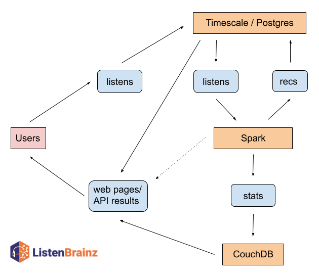

ListenBrainz Data Update Intervals
==================================

Expected schedule:

=============================================== =========================================
System                                          Update schedule
=============================================== =========================================
Receiving listens, updating listen counts		Immediate [#f1]_
Deleting listens					                  Removed at the top of the next hour (UTC)
Updating statistics for new listens			    Daily [#f2]_
Removing deleted listens from stats			    On the 2nd and 16th of each month
Full dumps						                      1st and 15th of each month
Incremental dumps					                  Daily
Artist and track similarity					        Every Sunday
Link listens						                    Monday morning at 2AM (UTC)
Weekly playlists						                Monday morning, based on the user's timezone setting
Daily playlists [#f3]_						          Every morning, based on the user's timezone setting
=============================================== =========================================

Situations will occasionally arise where these take longer. If you have been a very patient user, and
something still hasn't updated, check our `forum <https://community.metabrainz.org/>`_ for news or discussion.
If you suspect something has gone very wrong you can also search for tickets, and lodge new tickets, in our
`ticket tracker <https://tickets.metabrainz.org/projects/LB>`_.

This complicated schedule is caused by ListenBrainz having a lot of interconnected parts that work at
different scales. For more details, read on!

.. [#f1] Listens via a connected Spotify account may not be submitted immediately, causing a short delay
.. [#f2] Statistics may take longer on the 1st and 15th of each month
.. [#f3] To generate daily playlists, follow `troi-bot <https://listenbrainz.org/user/troi-bot/>`_.

Listens and Listen Counts
^^^^^^^^^^^^^^^^^^^^^^^^^

Listen submitted via the ListenBrainz API should appear in your Dashboard immediately. The Spotify API does
not immediately report completed listens; it may take several minutes for these to be reported to ListenBrainz.

Listen Count should always be up to date for listens that we have received. The only time we deviate
from this is when listens are to be deleted. Deleting a listen is (surprisingly) a fairly expensive operation
and we have the resources for keeping listen counts updated, but not to keep listen counts fully up to date
when listens are being deleted. Any listens marked for deletion will be deleted at the top of the next hour.
Once this happens, your listen counts will be consistent again.

We’ve spent months working on making this system work well and be scalable. This system is surprisingly
complex and it took us several approaches to get to where we are now. It isn’t ideal but, given our limited
resources, we opted for what we call an “eventually consistent” system that focuses on being consistent
(accurate) for most of our users most of the time.

User Statistics
^^^^^^^^^^^^^^^

Calculating user statistics is an entirely different and challenging task! For this we utilize the Spark
database system (more on this below), which requires us to dump, copy and import many gigabytes of data
from our Postgres database into Spark.

Currently, we use our data dumps for this purpose – we dump the full data twice a month on the 1st and
15th of the month and dump incremental dumps on a daily basis. The daily dumps update the listen data in
our Spark system with new listens, but they do not remove any listens from Spark that may have been deleted
from the main database since the last incremental dump. Deleted listens are removed from Spark only when we
import a new full data dump on the 2nd and 16th day of the month.

For example: If you delete a listen on the 5th day of the month, you can expect that the statistics generated
on the 17th will reflect the current stats of your listens as of the end of the 14th day of the month.

We recognize that this is less than ideal – we’re considering how to improve this and to make the ingestion
of listens and the deletion of listens both happen in real time.

MBID Mapper & MusicBrainz Metadata Cache
^^^^^^^^^^^^^^^^^^^^^^^^^^^^^^^^^^^^^^^^

The MBID mapper is reponsible for taking an incoming listen and using nothing but artist name and recording
name and finding the best match in MusicBrainz. This process normally works quite well, except for when music
you'd like to listen to doesn't yet exist in MusicBrainz.

The mapper attempts to map a recording when:

#. A new listen comes in (we've never seen this listen before). If a listen is not matched, we set a timer for when to try to match the listen again. We start the timer at 1day, but for each time we fail to match it we will double the delay before try it again, up to a max of 30 days.
#. When a previously unmatched listen comes in again, we'll attempt a remapping.
#. Our periodic mapping process will go over all unmapped listens and attempt to map them. This process can take quite some time to complete (weeks at times!) and once complete it will start over again the next day.

If a listen cannot be mapped, the user can optionally tell us how to map the listen with the "Link with
MusicBrainz" feature from the listen card. A few notes about this:

#. If you have an unmatched listen in your stats and then you manually link the listen, the stats will not update until the next time listens are loaded again (2nd and 16th of the month, see above)
#. If you would like to manually map a listen, but the recording does not exist in MusicBrainz, you'll need to add it there (or wait for someone else to add it). Once it has been added to MusicBrainz, it will be available for manual mappping in about 4 hours.

ListenBrainz data infrastructure
^^^^^^^^^^^^^^^^^^^^^^^^^^^^^^^^

The ListenBrainz project makes use of three major types of databases: Postgres/Timescale, Spark and CouchDB.
Postgres is our primary workhorse that serves user data (accounts, followers, likes/hates, etc). Timescale
(an extended version of Postgres) is used to store Listens and Playlists. Postgres and Timescale are fantastic
tools for providing a specific piece of information quickly (e.g which users does this a user follow).
However Postgres/Timescale are not great for inserting large amounts of data into the database each day – it
slows everything down for everyone. So we store the computed user listening statistics in CouchDB, which is
suitable for ingesting large volumes of data and serving it for a day, before it is replaced with the next
iteration of the data.

Finally, we have Spark, which is a batch processing system. Spark is designed to work with large datasets in a
batch fashion, where the data for *all* users might be processed in one batch task. Spark works with huge amounts
of data in one go, which is very distinct from our use of Postgres/Timescale and CouchDB.

All of the tools we use are excellent open source tools. Each does a fantastic job, at the tasks they were
designed for. There is no one open source solution for all of our needs, so we shuffle data from one system to
another as we need it. This, however, brings latency and delays in keeping all of our data up to date.

Take a look at the general overview of how data flows between each of these systems:

In the future we hope to serve content (stats) directly from our Spark installation (with the help of 
existing tools) as indicated by the dotted arrow between Spark and the API/web pages box. This will further
reduce the latency of some of our services.
