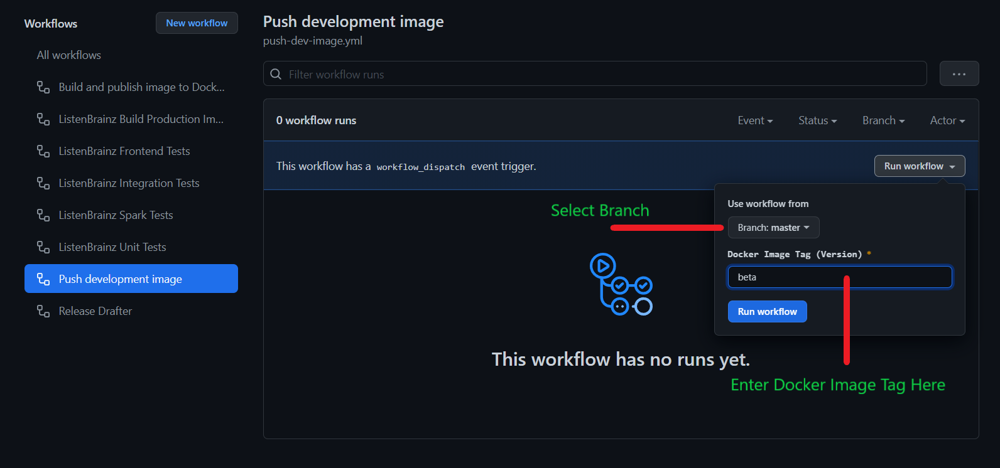
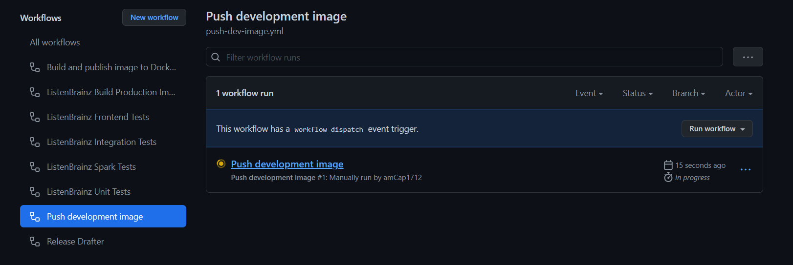

Building Docker Images
======================

.. note::

    This documentation is for ListenBrainz maintainers for when they deploy the website

Production Images
^^^^^^^^^^^^^^^^^
When a Github release is made, production images are automatically built and pushed by the
`Publish image <https://github.com/metabrainz/listenbrainz-server/actions/workflows/deploy-image.yml>`_ action.
The git tag associated with the Github release is used as docker image tag.

Test Images
^^^^^^^^^^^

From time to time we want to build images to test PRs on beta.listenbrainz.org or test.listenbrainz.org. To build
images for this purpose you can either use the `docker/push.sh` script or Github Actions.

.. note::

    Usually, the tags for these images is test or beta. However, you can use any arbitrary image tag. This is
    useful if you want to test multiple PRs simultaneously or avoid conflicting with another developer's images.
    These image tags appear on Dockerhub forever unless removed manually. To my knowledge it is not an issue.
    Regardless its not a bad idea to login to Dockerhub once in a while and clean up such unused test tags.

Using Github Actions
^^^^^^^^^^^^^^^^^^^^

#. Go to `Actions -> Push deployment image <https://github.com/metabrainz/listenbrainz-server/actions/workflows/push-dev-image.yml>`_.
#. Select the branch and enter the docker image tag (version).

#. Click on Run Workflow.
#. The image will be built and pushed to Docker Hub with the desired tag.
#. To monitor the status of the build, wait for the workflow run to appear. You may need to wait for a
   few seconds and reload the page.

Using docker/push.sh script
^^^^^^^^^^^^^^^^^^^^^^^^^^^

If Github Actions is unavailable or you want to take advantage of local docker build cache, you can use the
`docker/push.sh` script. You will need to be correctly authenticated to docker hub to push this image. From
the repository root, invoke the script with desired docker image tag. For example:

.. code-block:: bash

    ./docker/push.sh beta
